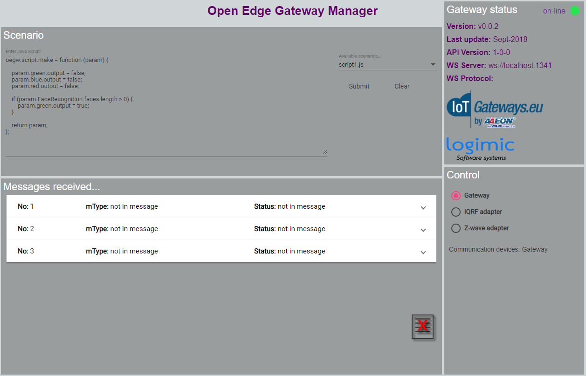

# Gateway Manager



The tool for easy configuration of your Open Edge Gateway.

# A. Run as standalone

Download executable for Win or Linux machines from [Releases](https://github.com/logimic/gateway-manager/releases).

# B. Run via local web Server

## 1. Prerequisites

1. **npm & node.js**

    How to install it is here: https://nodejs.org/en/

2. **Local Web Server** https://www.npmjs.com/package/local-web-server

    Install:
    ```
    $ npm install -g local-web-server
    ```

## 2. Run

1. From [releases](https://github.com/logimic/gateway-dashboard/releases) download **www.zip** and unzip somewhere.
2. Run local web server in unzipped **www** or in any superior folder.
    ```
    $ ws -p 8181
    ```
    * The _8181_ number is port specification.
    * Then see command line displaying serving IP:
    ```
    Serving at http://192.168.1.228:8181
    ```
3. Open Web Browser on local or any other network computer and navigate to the serving address.

# C. Build from sources

## 1. Prerequisites

1. **npm & node.js**

    How to install it is here: https://nodejs.org/en/

2. [Angular CLI](https://github.com/angular/angular-cli) version 1.3.2. Latest recommended version for build is 1.4.3. Install:
```
npm uninstall -g @angular/cli
npm cache clean
# if npm version is > 5 then use `npm cache verify` to avoid errors (or to avoid using --force)
npm install -g @angular/cli@1.4.3
```

## 2. Building after pulling from Github

1. Open terminal/command line and go to main folder.
2. Install local packages from command line.

```
rm -rf node_modules dist # use rmdir /S/Q node_modules dist in Windows Command Prompt; use rm -r -fo node_modules,dist in Windows PowerShell
npm install --save-dev @angular/cli@1.4.3
npm install
```


## 3. Run via Electron
Inspired by [this page..](http://www.blog.bdauria.com/?p=806)

1. Install Electron
```
npm install -g electron
```

2. Create **..\src\electron** folder with two files:

  * **electron.js**
  ```
  // src/electron/electron.js

  const {app, BrowserWindow} = require('electron')

  // Keep a global reference of the window object, if you don't, the window will
  // be closed automatically when the JavaScript object is garbage collected.
  let win

  function createWindow () {
    // Create the browser window.
    win = new BrowserWindow({width: 1024, height: 768})

    // and load the index.html of the app.
    win.loadURL(`file://${__dirname}/index.html`)

    // Open the DevTools.
    win.webContents.openDevTools()

    // Emitted when the window is closed.
    win.on('closed', () => {
      // Dereference the window object, usually you would store windows
      // in an array if your app supports multi windows, this is the time
      // when you should delete the corresponding element.
      win = null
    })
  }

  // This method will be called when Electron has finished
  // initialization and is ready to create browser windows.
  // Some APIs can only be used after this event occurs.
  app.on('ready', createWindow)

  // Quit when all windows are closed.
  app.on('window-all-closed', () => {
    // On macOS it is common for applications and their menu bar
    // to stay active until the user quits explicitly with Cmd + Q
    if (process.platform !== 'darwin') {
      app.quit()
    }
  })

  app.on('activate', () => {
    // On macOS it's common to re-create a window in the app when the
    // dock icon is clicked and there are no other windows open.
    if (win === null) {
      createWindow()
    }
  })

  // In this file you can include the rest of your app's specific main process
  // code. You can also put them in separate files and require them here.
  ```
  * **package.json**
```
{
  "name"    : "GatewayManager",
  "version" : "0.1.0",
  "main": "electron.js",
  "scripts": {
    "start": "electron ."
  }
}
```
3. Update **index.html** this way:

```
<base href="/">
```
change to
```
<base href="./">
```
4. Update **package.json** in project (note that **www** is folder done via **ng build** :()

```
"scripts" {
[...]
"build-electron": "ng build --base-href . && copy src\\electron\\* www",
"electron": "npm run build-electron && electron www/electron.js"
},
[...]
```

5. Run
```
$ ng build
$ npm run electron
```

## 4. Deployment via Electron

This uses [electron-packager](https://github.com/electron-userland/electron-packager) and creates standalone app runnable on many operating systems.

1. Instal package via npm if you didn't
```
# for use from cli
npm install electron-packager -g
```
2. Go to **../gateway-manager/www/** folder (or dist/ or whenever you have electron build)
3. Make package
```
electron-packager ./ --all
```
4. You should see **../gateway-manager/www/angular-electron-win32-x64/** folder on Win.  Inside you run **.exe** app
5. If any issues see https://github.com/electron-userland/electron-packager


## 5. Further help

To get more help on the Angular CLI use `ng help` or go check out the [Angular CLI README](https://github.com/angular/angular-cli/blob/master/README.md).
